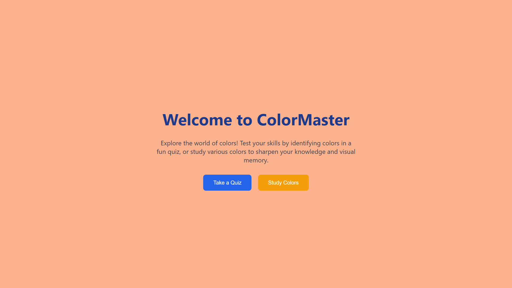
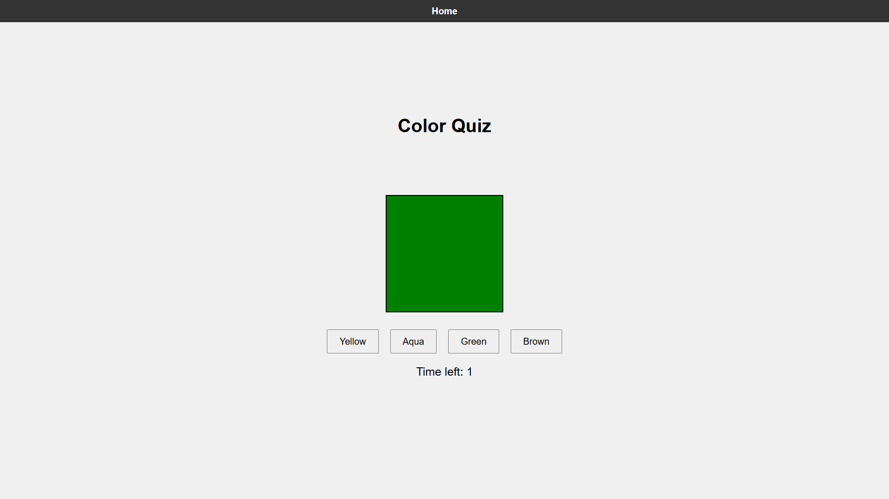
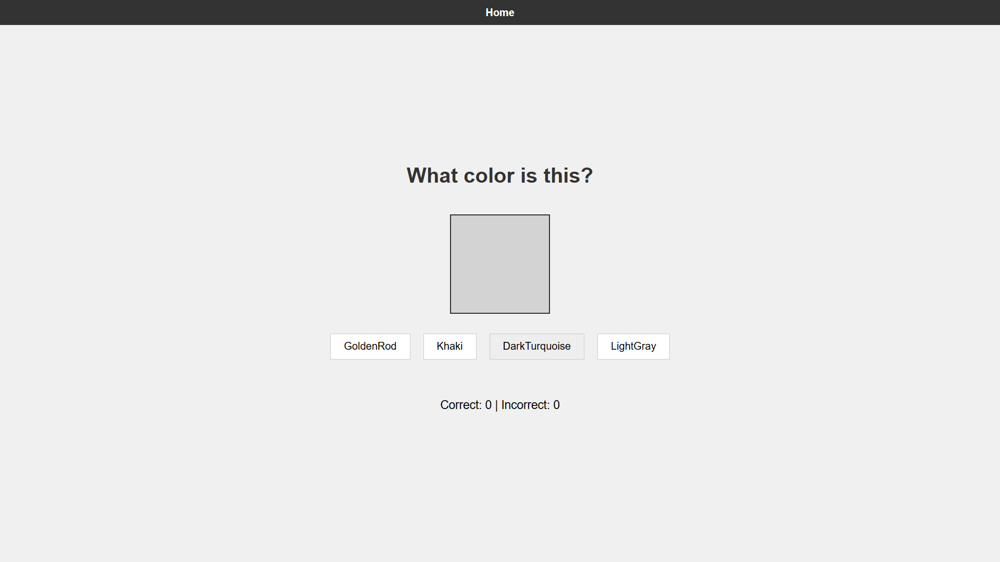

# ColorMaster 🎨

ColorMaster is an interactive web app designed to help users explore, learn, and test their knowledge of color names through quizzes and color-matching exercises.

## 🌟 Features

- 🧠 10-question timed color quiz.
- 📚 Study mode with unlimited practice.
- 🎨 Uses over 100 named CSS colors.
- ⚡ Clean UI with animated backgrounds and intuitive layout.

## 🚀 Getting Started

1. Clone the repo:
   ```bash
   git clone https://github.com/vishal-git-dot/ColorMaster.git

## 📸 Screenshots

### 🏠 Landing Page


### 🎯 Quiz Page


### 🧪 Study Mode


   


